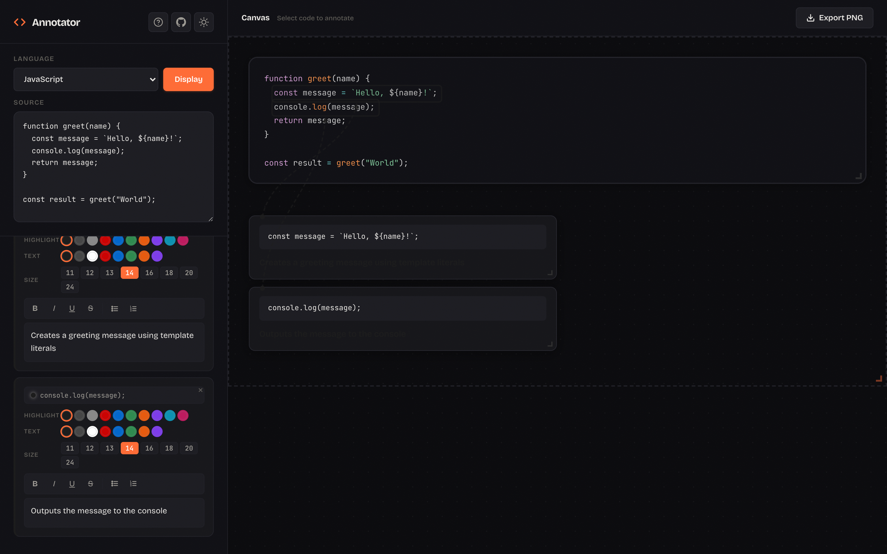
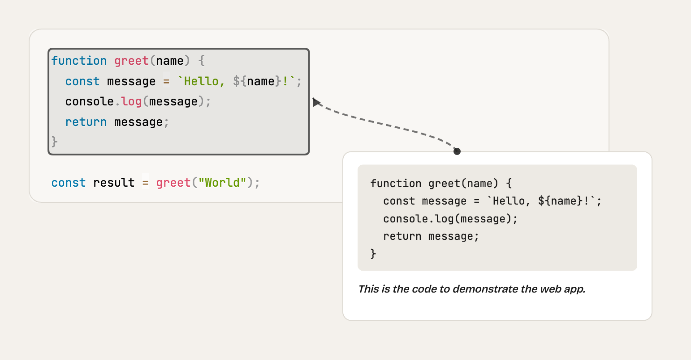

# Code Annotator

**Create beautiful, annotated code snippets for documentation, presentations, and teaching — entirely in the browser.**



**Example output:**



## Features

- **Syntax Highlighting** — 19 languages supported via Prism.js
- **Text Selection Annotations** — Select any text in your code to create annotation cards
- **Rich Text Editing** — Bold, italic, underline, strikethrough, and lists
- **Customizable Styling** — Highlight color, text color, and font size per annotation
- **Drag & Drop** — Freely position annotation cards and arrows on the canvas
- **Resizable Elements** — Resize code block, annotation cards, and export area
- **Dark / Light Theme** — Toggle to match your preference
- **PNG Export** — Preview and download your annotated code as a PNG image
- **Privacy First** — Runs entirely in the browser; no data leaves your machine

## Quick Start

### Prerequisites

- [Node.js](https://nodejs.org/) (v16+)

### Install & Run

```bash
git clone https://github.com/fairy-pitta/code-annotator.git
cd code-annotator
npm install
npm run dev
```

Open [http://localhost:8788](http://localhost:8788).

### Deploy

```bash
npm run deploy
```

Deploys to Cloudflare Workers.

## Usage

1. **Paste** your code and select the language.
2. **Select** text in the code display to create an annotation.
3. **Write** your explanation using the rich-text editor in the sidebar.
4. **Customize** colors, font size, and drag cards/arrows into position.
5. **Export** as PNG — preview first, then download.

## Tech Stack

| Layer | Technology |
|-------|------------|
| Frontend | Vanilla JavaScript |
| Syntax Highlighting | [Prism.js](https://prismjs.com/) |
| Image Export | [html2canvas](https://html2canvas.hertzen.com/) |
| Hosting | [Cloudflare Workers](https://workers.cloudflare.com/) |

## Privacy

Code Annotator is a **frontend-only** application. All processing happens in your browser — no code, annotations, or images are sent to any server.

## License

[MIT](LICENSE)
